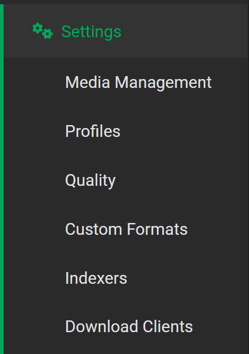
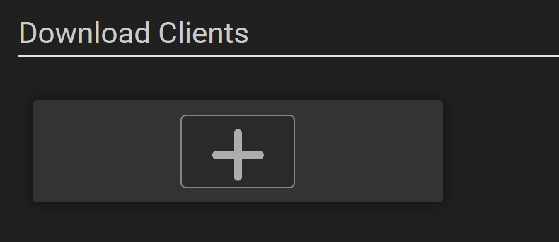
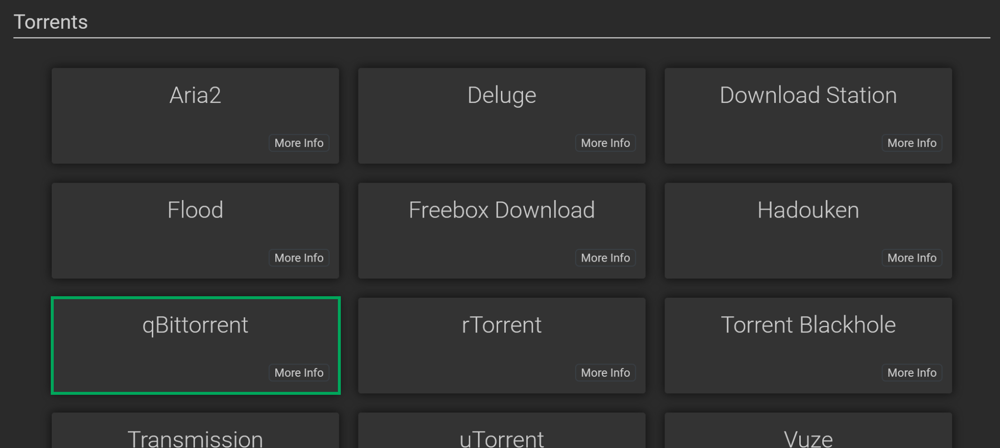
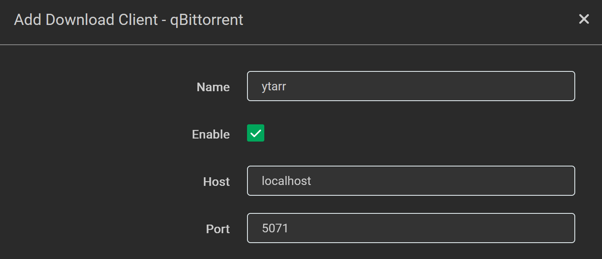
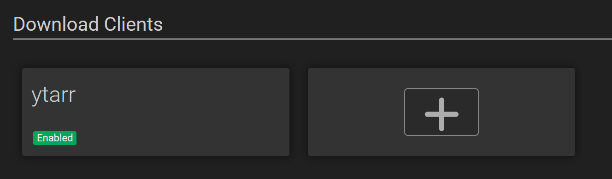
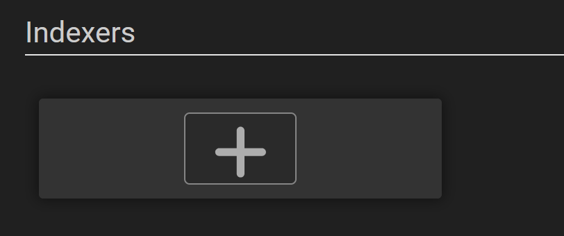
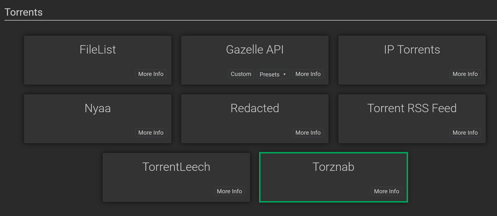
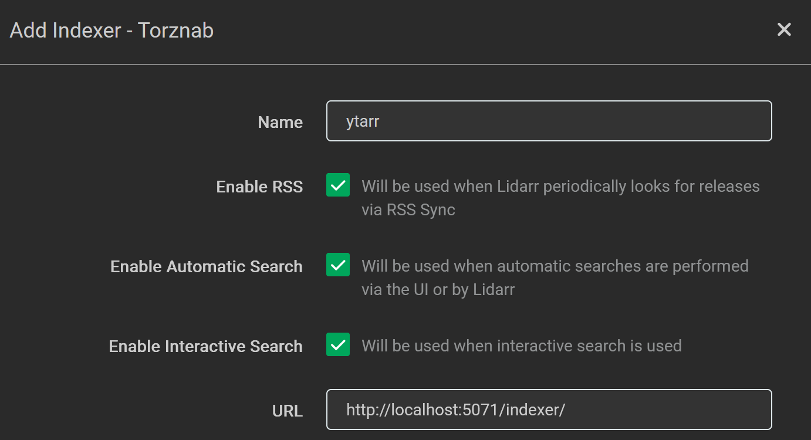
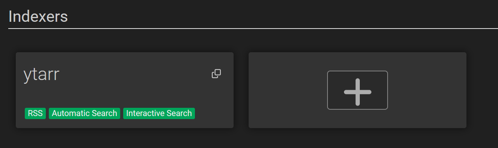

</img>

ytarr is a node app that emulates a qBittorrent client for Lidarr to allow for yt-dlp downloads

# Requirements
- [Node.js](https://nodejs.org/)
- [Lidarr](https://lidarr.audio/)
- [yt-dlp](https://github.com/yt-dlp/yt-dlp) installed on PATH

# Installation
- Clone or download this repo
- Run `LAUNCH.bat` or `npm i; node index.js` in cmd
- Follow for instructions for both the [download client](#download-client) and [indexer](#indexer) if you haven't set that up in Lidarr yet

# Lidarr Instructions

Open Lidarr on `http://localhost:8686/` and open the settings tab

</img>

## Download Client

In the settings tab, click on 'Download Clients', you will see the following

</img>

Click on the plus to add a client, and click on qBittorrent (this is because Torrent Blackhole cannot update live, thus i opted to emulate the qBittorrent endpoints)

</img>

Fill in the name and port (host should be default be localhost), name is optional but makes it easier to manage if you have multiple clients.

The port can be changed with an `.env` file with `PORT=XXXX` with any port number you want, make sure to also reflect that change in this config

</img>

Then click on 'Save' in the bottom-right corner of the modal. You should see the following

</img>

If you get an error in the top of the modal (that means the test has failed) double check if the server is running and that all the information has been entered correctly. If there is still an error, make an issue in GitHub with the error and any other useful information

## Indexer

The indexer is mainly the same as the download client:

In the settings tab, click on 'Indexers', you will see the following

</img>

Click on the plus to add an indexer, and click on Torznab

</img>

Fill in the url and name (you can copy paste `http://localhost:5071/indexer/` if you didn't change the PORT)

</img>

Then click on 'Save' in the bottom-right corner of the modal. You should see the following

</img>

If you get an error in the top of the modal (that means the test has failed) double check if the server is running and that all the information has been entered correctly. If there is still an error, make an issue in GitHub with the error and any other useful information

> Note that this guide has been made according to all the versions on my machine, which are Lidarr 3.1.0.4875, Node v24.14.0, and yt-dlp 2026.07.04. Newer versions might break this program or this guide, always check your versions!